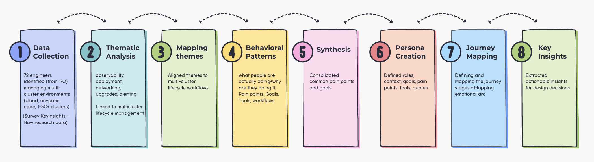

## User research survey results to Hybrid Engineer persona generations and journey mapping

### What drove the decision to develop personas and journey maps?

Even after collecting multi cluster survey <b>research raw data and summarizing results</b>, the information can <b>still feel scattered and difficult</b> for us to apply directly in the <b>multi cluster solutions.</b> 

The <b>research raw data</b> explains what engineers said and <b>what problems exist</b>, but it does not always make it clear how those problems affect different types of engineers or when exactly they occur in real life situations.

By using the user research methods such as Creating personas and journey maps helps <b>organize this information in a way that is easier to understand and use.</b>

### What is user(Engineer) Persona?

Personas can be thought of as <b>simplified representations of different types of users.</b> Instead of looking at many individual responses, similar behaviors and challenges are grouped together into one “type” of user. This makes it easier for teams to think about real people rather than abstract data. 

For example, instead of saying “some users struggle with deployment,” the team can refer to a specific type of user who regularly faces that challenge and understand their situation more clearly. 

<b>Persona interms of Engineer:</b> 

When engineering teams build platforms, APIs, or tools, we often say we are designing for “developers.”
But the reality is, there is no single type of developer.

Some engineers are platform engineers managing infrastructure. Some are application developers deploying services. Others work across cloud and on-prem environments. Each of them has different workflows, goals, and pain points. So if we design only based on assumptions about “the developer,” we risk solving the wrong problems.This is where personas help.

A <b>persona is a research-based representation of a group of users who share similar behaviors, goals, and challenges.</b> Instead of looking at dozens of individual responses from engineers(not only due to privacy considerations)  as well as there are also several practical and methodological reasons such as <b>Time efficiency:</b> Reviewing and interpreting large volumes of raw qualitative responses is extremely time-consuming for everyone involved, and becomes increasingly impractical as the survey corpus grows over time. 

<b>Risk of bias:</b> Working directly from raw responses can increase the likelihood of confirmation bias, selective interpretation, or over indexing on particularly memorable or recent responses especially for individuals who are not formally trained in qualitative research methods.

<b>Lack of structure for decision-making:</b> Raw responses are not organized in a way that supports synthesis. They do not follow a consistent, time-tested format that highlights the most important and decision-relevant insights. In contrast, personas are designed to consolidate and elevate key findings in a standardized format that better supports product and UX decision-making.

By moving from <b>raw data → patterns → synthesized insights → personas, </b>we ensure the output is both <b>analytically well-founded and usable for design and product decisions.</b>

Once we have the synthesized insights, we update those insights into the standart <b>persona templete</b>(A persona template is a simple, structured profile that represents a typical user to help guide design and product decisions.)

For example: common deployment challenges, debugging workflows, or documentation needs. Then we synthesize those patterns into a representative profile of an engineer.

### What is user journey mapping (Workflow mapping)?

<b>Journey mapping (In engineering terms workflow mapping)</b>, on the other hand, shows the <b>step-by-step experience of that engineer</b>. Rather than looking at problems in <b>isolation, it connects them into a sequence</b>. 

This helps identify when issues happen—for example, whether a problem occurs at the beginning of a task, during execution, or at the final stage. Seeing the <b>full flow makes it easier to understand how one issue can lead to another.</b>

This step is important because it helps teams focus on what matters most. Research often reveals many different problems, but not all of them are equally important. <b>By organizing the information into user types and their experiences, it becomes clearer which problems have the biggest impact and should be addressed first.</b>

It also helps different teams stay aligned. When people from different backgrounds such as engineering, product, or management look at raw data, they may interpret it differently. <b>Personas and journey maps provide a shared understanding, so everyone is working with the same picture of the user and their challenges.</b>

Most importantly, this process helps turn research into action. Without it, <b>research can remain as a collection of findings without clear direction. </b>By clearly defining who the users are and how they experience a process, teams can <b>more easily decide what improvements to make and where to focus their efforts.</b>

In simple terms, <b>research results tell what is happening, while personas and journey maps explain who it is happening to and how it happens step by step.</b> This makes it much <b>easier to make informed and effective production decisions.</b>

## The process of creating personas and journey maps from raw research data and insights

The process begins with <b>raw research data</b> and <b>survey insights</b>, which are analyzed to <b>identify patterns by clustering similar responses and extracting recurring themes.</b> These patterns are then synthesized to define key user pain points and goals. 

(At a glance) Steps for Creating Personas and Journey Mapping:

→ <b>Raw Data + Survey key insights</b>

→ <b>Pattern Identification</b> (cluster similar responses and extract recurring themes)

→ <b>Synthesis of Pain Points & Goals</b> (identify and consolidate key user challenges and objectives)

→ <b>Persona Creation</b> (assemble insights into a structured persona template)

→ <b>Journey Mapping or workflow Mapping</b> (map user interactions, behaviors, and experiences across stages)

→ <b>Product Insights</b> (derive actionable opportunities and improvements)

Based on this synthesis, personas are created by structuring the insights into a standardized persona template. Journey maps are subsequently developed to visualize user experiences across different stages. Finally, product insights are derived to inform design decisions and identify opportunities for improvement.

<b>Resources: </b>
You can read full article here about the persona: <a href="https://dev.to/priya_sajja_c336921bbda87/what-is-engineer-persona-5e29">Link</a>

